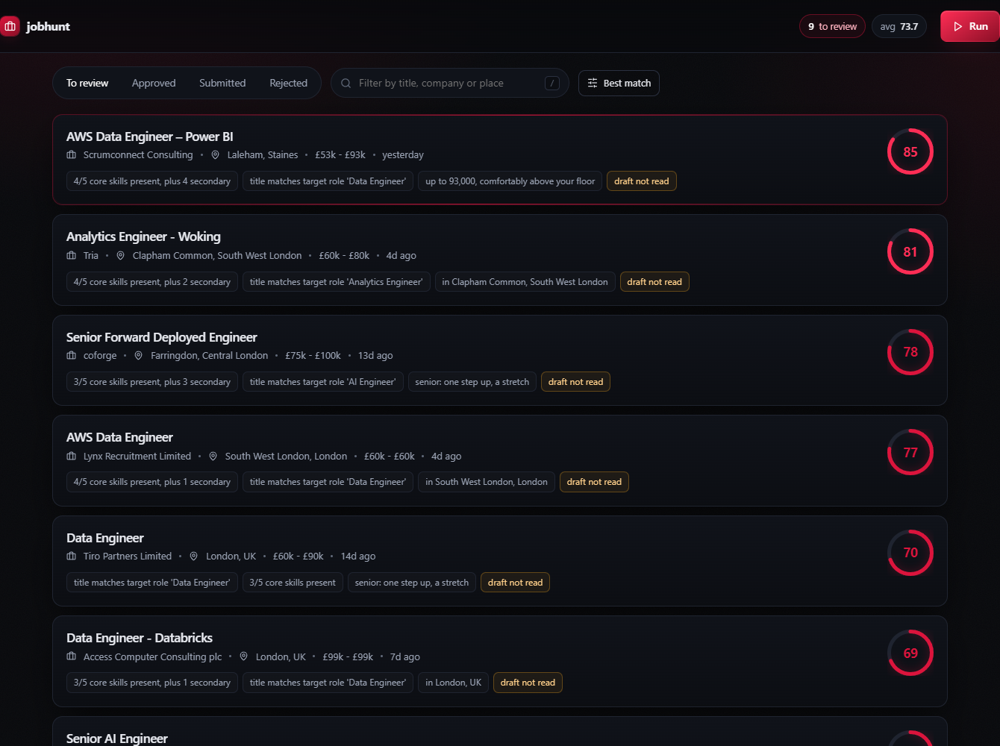
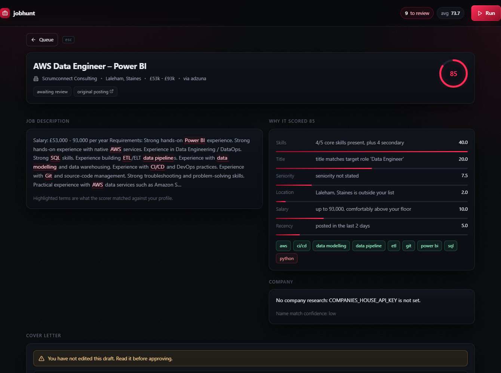

# jobhunt

A background job search pipeline that finds postings, scores them against your
CV and shows its working, researches the company from public records, drafts a
cover letter from evidence you wrote, pushes it to your phone, and then **stops**.

Approving and submitting are yours. That is a design decision, not a missing
feature, and it is enforced in the type system rather than by a config flag. See
[Why it does not press submit](#why-it-does-not-press-submit).

```
   sources          scoring            review                  you
 ┌──────────┐    ┌───────────┐    ┌──────────────┐      ┌─────────────┐
 │  Adzuna  │───▶│  score +  │───▶│  research    │─────▶│  read, edit │
 │   Reed   │    │  blockers │    │  draft       │  📱  │  approve    │
 └──────────┘    └───────────┘    │  notify      │      │  submit     │
                       │          └──────────────┘      └─────────────┘
                       ▼
                   rejected,
                 with a reason
```



Scores are explained rather than asserted, and the skills the scorer matched are
highlighted inside the job description, so you can see what it saw:



---

## Start here

- **[docs/DESIGN-DECISIONS.md](docs/DESIGN-DECISIONS.md)** - why it is built this
  way and what each choice cost
- **[docs/ARCHITECTURE.md](docs/ARCHITECTURE.md)** - five diagrams: the pipeline,
  the application state machine, scoring, letter drafting, the daemon loop
- **[docs/ENGINEERING-NOTES.md](docs/ENGINEERING-NOTES.md)** - what is wrong with
  it, what it cannot do, and the two bugs the tests caught during the build
- **[docs/SETUP.md](docs/SETUP.md)** - getting the four keys and running it

---

## What it actually does

**Finds.** Adzuna and Reed, both official APIs with free tiers. One query per
search term, rate limited, with an identifiable user agent. It does not scrape
LinkedIn or Indeed: both forbid it, and a restricted account would cost you more
than the extra coverage is worth.

**Scores, and explains.** Every job gets a 0 to 100 score built from six named
components, each carrying a sentence you could quote. Hard blockers are separate
from points, so a job that wants 12 years of experience is *out* rather than
merely ranked lower.

```
82  Data Engineer - Example Ltd
    skills      4/4 core skills present, plus 3 secondary      32.0
    title       title matches target role 'Data Engineer'      20.0
    seniority   seniority not stated                            7.5
    location    in London, UK                                  10.0
    salary      up to 70,000, comfortably above your floor     10.0
    recency     posted in the last 2 days                       5.0
```

**Researches.** Companies House, for the facts that change whether you apply: is
this a real, active company, how old, filing what size of accounts. It reports
its own confidence in the name match rather than asserting facts about the wrong
"Acme Ltd".

**Drafts.** A cover letter built from your evidence bullets, in your register,
checked against a ban list and a fabrication test before you ever see it.

**Pings you.** One ntfy push per job worth your attention, capped per run and per
day, silent during quiet hours. Tapping it opens the review page.

**Stops.** The pipeline's last action is to put the application in
`awaiting_review`. There is no code path from there to submitted that does not
pass through a button you press.

---

## Why it does not press submit

You asked for auto-apply. Here is what I built instead and why.

**The failure is unrecoverable.** A wrong draft that reaches a real employer
cannot be unsent. Every other failure in this tool is a wasted API call.

**Unattended applications are worth less.** The reason a tailored letter works is
that it demonstrates you read the posting. Automating that away produces volume,
and volume is what employers already filter out.

**It would break the terms you are applying under.** The boards that carry most
UK jobs prohibit automated submission. An account restriction mid-search is a
bad trade for saved minutes.

So the last mile is **assisted**: the tool opens the real application form in a
visible browser, fills your name, email, phone, location, attaches your CV and
pastes the letter, then hands you the keyboard. You check it and click submit.

The gate is structural. `Application.advance` refuses any transition to
`SUBMITTED` that does not come from `APPROVED`, and `APPROVED` is only ever set
by a POST from the review page:

```python
if to is Stage.SUBMITTED and self.stage is not SUBMIT_REQUIRES:
    raise ValueError(
        f"refusing to submit {self.job.id} from {self.stage.value}: "
        f"submission requires {SUBMIT_REQUIRES.value}, set by human review"
    )
```

There are six tests whose only job is to prove that still holds.

---

## Letters that do not read as generated

The request was for letters that do not look machine-written. The honest way to
get that is to make them substantially yours, which also produces better letters
than asking a model to be impressive about a CV it just met.

**A closed set of facts.** The drafter may only use `evidence` entries from your
profile: things you wrote, that you can defend in an interview. The prompt says
so and the validator enforces it, rejecting any number in the draft that does not
appear in the evidence it was given. A model that cannot invent an achievement
uses a real one.

**Your register.** `voice_sample` in the profile is a paragraph in your own
writing, given as the style to match. Without it everything drifts to the same
neutral corporate voice.

**A ban list.** "I am writing to express", "passionate about", "proven track
record", "perfect fit" and fifteen others are rejected outright. A draft that
trips the list is regenerated once with the offending phrases named, and falls
back to the template drafter if it fails twice.

**Structural variety.** The opening move is chosen from the job id, so
consecutive applications do not all begin the same way. Deterministic, so
regenerating gives the same shape and your edits stay predictable.

**And then you edit it.** The review page shows an editable draft and flags any
letter you have not touched. That flag is the point: it is the difference
between a letter that is yours and one you are hoping nobody reads closely.

---

## The interface

A React single-page app served by the same FastAPI process, dark with crimson
used sparingly: score, danger, and the one action that matters on each screen.

- **Score ring and reason bars** that animate from the real numbers, so a 62 and
  an 88 do not look alike
- **Matched skills highlighted in the job description**, which is the difference
  between a score you trust and a number you squint at
- **Letter editor** that flags the drafter's banned phrases as you type, using
  the same list the backend validates against, so the highlight cannot drift
  from the rule
- **Keyboard-first**: `j`/`k` to move, `enter` to open, `a` approve, `s` skip,
  `ctrl+s` save, `/` filter. Twenty jobs by mouse is why tools like this go unused
- **Run from the browser**: starts a background pass and polls it, so you never
  leave the page to find new jobs

The server-rendered pages still exist at `/legacy`. They are not a leftover: if
`web/dist` is absent, the tool still works with no frontend build at all.

## Quick start

```bash
pip install -e ".[llm,browser]"
cp config.example.yaml config.yaml
cp profile.example.yaml profile.yaml   # edit: this is your CV
cp .env.example .env                    # edit: keys, all free

cd web && npm install && npm run build && cd ..   # builds the interface

jobhunt check              # validates everything before calling anything
jobhunt run --dry-run      # a full pass that notifies nobody
jobhunt review             # http://127.0.0.1:8765
jobhunt watch              # background, every 90 minutes
```

For frontend work, `npm run dev` in `web/` serves the UI on :5173 with hot
reload and proxies `/api` to the Python process on :8765.

[docs/SETUP.md](docs/SETUP.md) covers getting the keys. Adzuna, Reed, ntfy and
Companies House are all free; the Anthropic key is optional and costs a few pence
per letter.

## Commands

| Command | Does |
| --- | --- |
| `jobhunt check` | Validates config, profile and keys without calling any API |
| `jobhunt run` | One pass: fetch, score, research, draft, notify |
| `jobhunt run --dry-run` | The same, but nothing leaves the machine |
| `jobhunt watch` | On a timer, with quiet hours, until stopped |
| `jobhunt review` | Serves the review interface on localhost |
| `jobhunt status` | What is in the queue |

## Configuration

Preferences in `config.yaml`, secrets in `.env`. Nothing reads a credential out
of the YAML, so a config file is safe to share when asking why your matching is
odd. Both `config.yaml` and `profile.yaml` are gitignored, because they describe
you rather than the tool.

The two dials worth touching first:

- `scoring.notify_threshold` (default 65). Start here, watch what gets through
  for a couple of days, then move it.
- `scoring.weights`. Tune these rather than editing the scorer.

## Tests

```bash
pip install -e ".[dev]"
pytest
```

90 tests. The ones under `TestHumanGate` and `test_models.py` are the important
ones: if they fail, the tool can submit something nobody read.

## Licence

[MIT](LICENSE).
