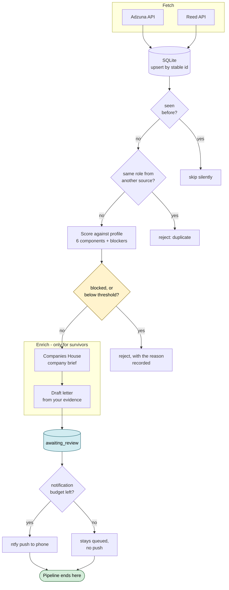
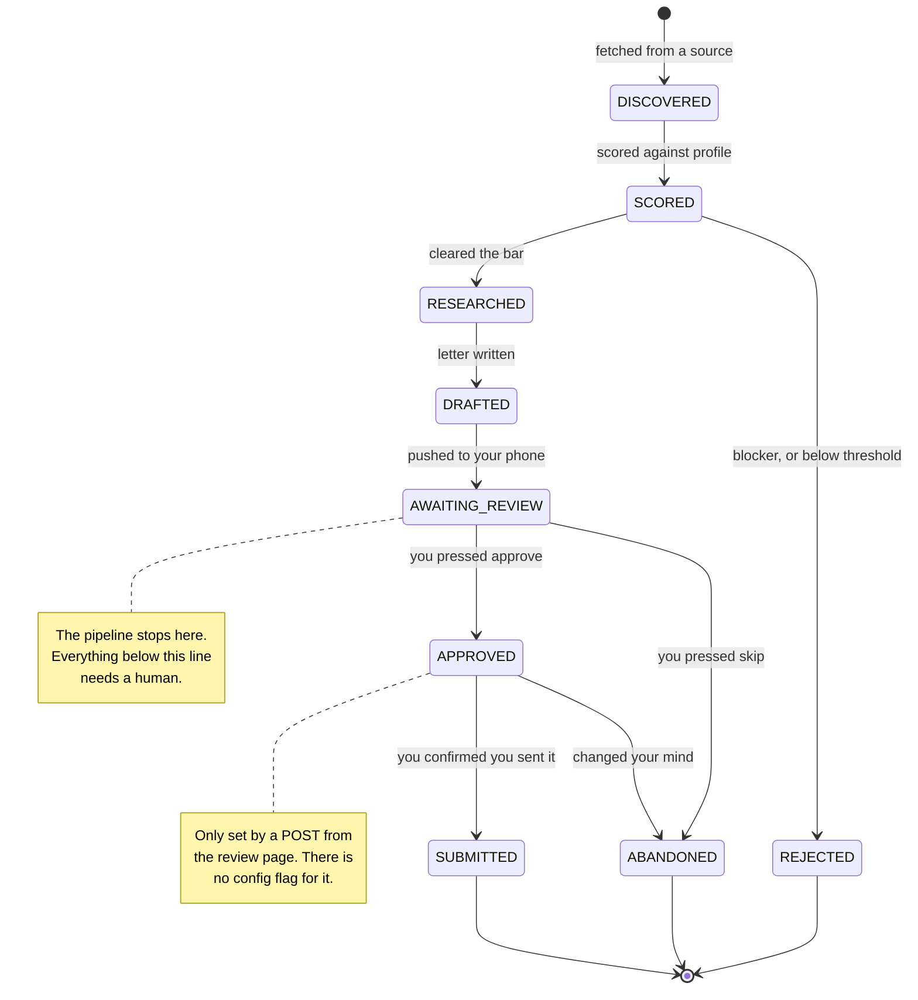
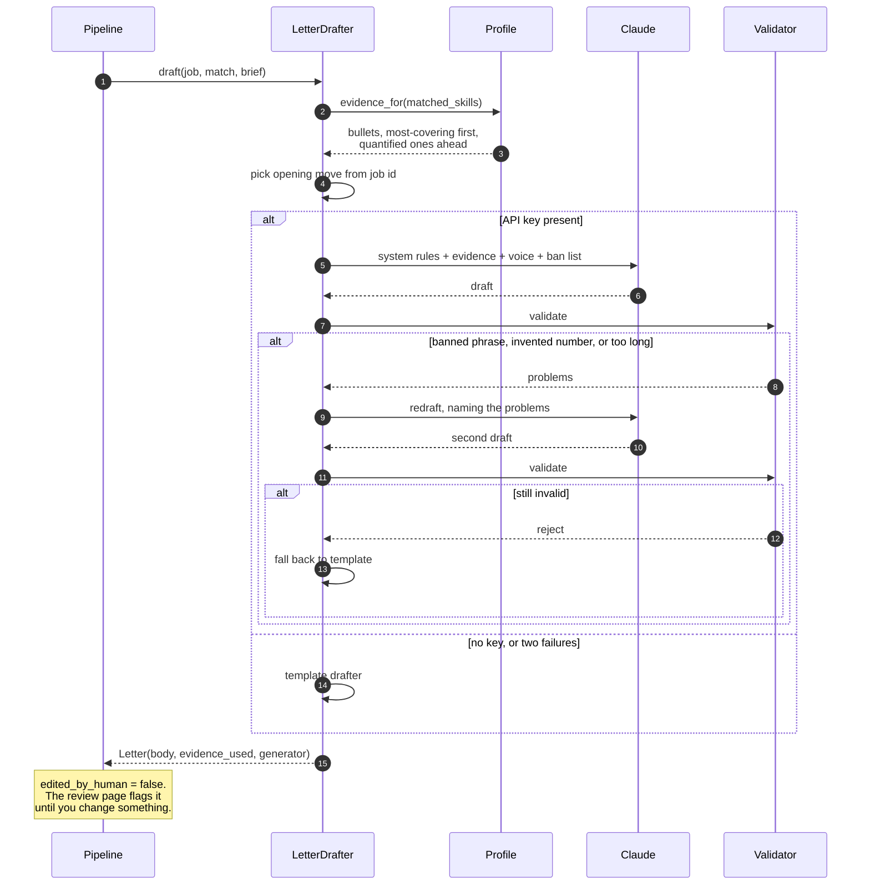
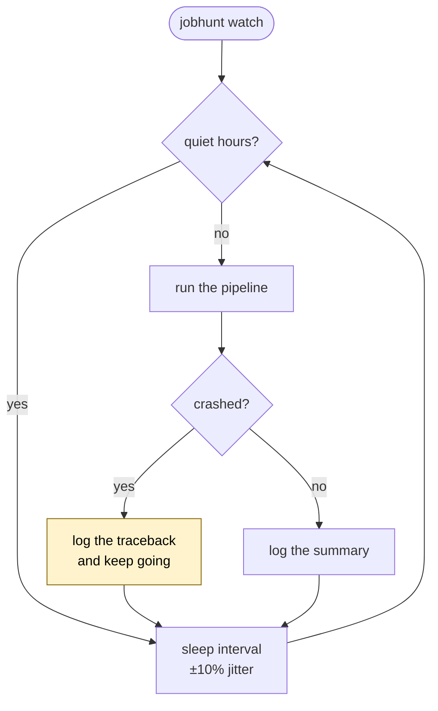

# Architecture

Five diagrams. All render on GitHub.

- [The pipeline](#1-the-pipeline)
- [Application state machine](#2-application-state-machine)
- [How a job is scored](#3-how-a-job-is-scored)
- [How a letter is drafted](#4-how-a-letter-is-drafted)
- [The daemon loop](#5-the-daemon-loop)

---

## 1. The pipeline

Ordering is about cost. Scoring is free and happens to everything. Research costs
an API call and only happens to jobs that cleared the threshold. Drafting costs
money and only happens to jobs that survived research. In practice around 90% of
what is fetched never reaches the drafter.

**The green terminator is the whole design.** The pipeline has no path to
submission. Everything after it is a human in a browser.

**Why the duplicate check exists.** The same role appears on Adzuna and Reed with
different ids. Without collapsing them you get two pushes for one job, and two
pushes for one job is how someone learns to ignore the notifications.

**Why rejections are stored rather than dropped.** `jobhunt status` can then
answer "why did I not see that job", which is the first question you ask when
tuning the threshold.

---

## 2. Application state machine

`Application.advance` enforces three rules: no transition out of a terminal
stage, no moving backwards, and `SUBMITTED` only from `APPROVED`. All three are
tested in `tests/test_models.py`.

The backwards rule matters more than it looks. Without it, a rerun that
re-scored an already-approved application would quietly reset it to `SCORED` and
put it back in the queue.

---

## 3. How a job is scored

```mermaid
flowchart LR
    JOB["Job posting"] --> BLOCK

    subgraph BLOCK["Hard filters - any hit is fatal"]
        direction TB
        B1["excluded company"]
        B2["excluded title term"]
        B3["contract when you want permanent"]
        B4["salary ceiling below your floor"]
        B5["asks for more years than your level"]
        B6["remote/onsite against your preference"]
    end

    BLOCK -->|"any hit"| OUT["rejected<br/>reason recorded"]
    BLOCK -->|"clean"| POINTS

    subgraph POINTS["Weighted components"]
        direction TB
        P1["skills 40"]
        P2["title 20"]
        P3["seniority 15"]
        P4["location 10"]
        P5["salary 10"]
        P6["recency 5"]
    end

    POINTS --> NORM["normalise to 0-100"]
    NORM --> REASONS["Match.reasons:<br/>a sentence per component"]
    REASONS --> LETTER["feeds the letter drafter"]
    REASONS --> UI["feeds the review page"]
    REASONS --> PUSH["feeds the notification"]

    style BLOCK fill:#f8d7da,stroke:#721c24,color:#000
    style REASONS fill:#d1ecf1,stroke:#0c5460,color:#000
```

**Blockers are not low scores.** Mixing them lets a job you cannot take clear the
threshold on unrelated keyword matches. Separating them also means the rejection
carries a reason a person can read.

**The reasons are the product.** A bare number would tell you a job is a 78 and
give the letter drafter nothing to work with. Each reason is a quotable sentence,
which is why the same objects feed the prompt, the page and the push.

**Absent data is neutral, not negative.** Most UK postings hide salary and many
do not state seniority. Those score the midpoint. Punishing a posting for being
terse would filter out most of the market.

---

## 4. How a letter is drafted

**The validator is the interesting part.** It checks three things: no phrase from
the ban list, within the word limit, and every number in the letter traceable to
the evidence supplied. The number check is a cheap fabrication test and it
catches the common failure, which is a model rounding "380,000" up to "half a
million" because it reads better.

**Two strikes, then the template.** A deterministic letter built from your own
bullets is better than a fluent one that states something untrue about you.

---

## 5. The daemon loop

**A crashed cycle must not kill the loop.** A daemon that dies at 2am and is
noticed at 9am has lost a day of postings, and the next cycle will very likely
succeed: most failures here are a timeout or a rate limit.

**Jitter** stops every cycle landing on the same minute past the hour, which is
politeness toward a free API more than anything else.

**Quiet hours** exist because a phone buzzing at 3am about a job that will still
be there at 9am is how someone ends up turning notifications off entirely, and a
notification you have muted is worse than one you never sent.
